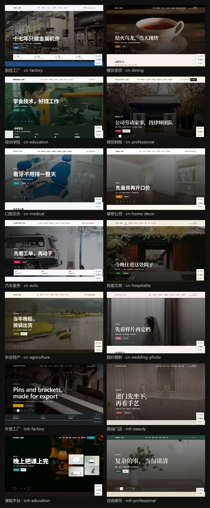

# 精装 · FitOut

> 便宜模型，也能装出好门面。

**不用任何密钥就能出站。** 装上 skill，跟 AI 说「给我公司做个官网」。AI 自己问企业信息、写好内容、跑一条命令。DeepSeek 密钥只在后面的批量填法里才要。没有生图密钥就跳过生图，站点照样能拼。

**v0.1 预览**：10 个行业的国内风「样板间」已经能用。[精酿 · BrewReel](https://github.com/Finderchangchang/brewreel) 的兄弟项目：精酿出片，精装出官网。

## 三步上手

1. 装 skill。仓库放在本机任意目录，下面写成 `<精装仓库目录>`。把 `skill\fitout` 整个文件夹拷出去，文件夹名保持 `fitout`，里面要有 `SKILL.md`。

Claude Code：

```powershell
New-Item -ItemType Directory -Force -Path "$env:USERPROFILE\.claude\skills" | Out-Null
Copy-Item -Recurse -Force "<精装仓库目录>\skill\fitout" "$env:USERPROFILE\.claude\skills\fitout"
```

Codex：同样拷到 `$env:USERPROFILE\.codex\skills\fitout`。

Grok：同样拷到 `$env:USERPROFILE\.agents\skills\fitout`，或 `$env:USERPROFILE\.grok\skills\fitout`。

2. 新开一轮对话，对 AI 说「给我公司做个官网」。它会问企业信息，确认后在一个站点目录里出站。

3. 打开该目录的 `site/index.html`。要上线，按同一目录的 `交付说明.md` 发到 GitHub Pages。这条命令不会替你发布。

一个站点一个目录：

| 文件 | 是什么 |
|---|---|
| `企业档案.md` | 事实。AI 问答后写在这里 |
| `site.json` | AI 填的站点内容 |
| `photos/` | 你给的照片 |
| `img/` | 生成或处理后的图 |
| `site/` | 生成的网站 |
| `交付说明.md` | 用了哪套样板间、缺哪些实拍、怎么发布 |

改内容：改 `企业档案.md` 或 `site.json`，让 AI 重跑同一条命令。细节在 [skill/fitout/SKILL.md](skill/fitout/SKILL.md)。

`site.json` 里这几处用框架现在的字段：首屏是 hero 板块的 `mode` 和 `slides`，导航是 `children` 或 `autoChildren`，深色板块可写 `bg`，列表写 `pageSize`，页脚二维码是 `contact.qrcodes`。说明在 [docs/SITE_JSON.md](docs/SITE_JSON.md)。

给中小企业一键生成**好看、统一、拎包入住**的官网：挑一套样板间，按企业档案填内容，脚本拼出一整套静态官网（首页 + 关于 + 产品 / 服务列表和详情 + 团队 + 新闻 + 联系），传上 GitHub Pages 就能上线，手机打开不乱。



## 要解决什么

让 AI 给小公司做官网，常见的结果是：
- 每次长得都不一样，同一个人做十家，十种水平；
- 一股 AI 味，或者反过来太素，不像一家正规公司；
- 换成便宜模型，排版就崩。

精装的办法和精酿一样：**审美写进样板间，模型只填空。**

## 样板间

每套样板间 = 一整套成熟官网的版面（整站页面、图片位、动效）+ 我们自己的配色和细节。客户挑一套，换上自己的内容就能交房。

| 行业 | 样板间 | 适合谁 | 主要页面 |
|---|---|---|---|
| 制造工厂 | `cn-factory` | 机械、五金、零部件、建材工厂 | 产品中心（型号参数表）、生产设备、资质荣誉、应用领域、询价 |
| 餐饮茶饮 | `cn-dining` | 茶饮、餐饮、烘焙连锁和单店 | 品牌故事、产品、门店分布、加盟合作 |
| 培训学校 | `cn-education` | 职业技能学校、兴趣培训中心 | 课程设置、师资力量、学员风采、预约试听 |
| 律所财税 | `cn-professional` | 律师事务所、财税代账、企业咨询 | 专业领域、律师团队、典型案例、法律知识 |
| 口腔诊所 | `cn-medical` | 口腔诊所、社区诊所、中医馆 | 诊疗项目、医生团队、就诊指南、口腔科普 |
| 装修公司 | `cn-home-decor` | 家装公司、全屋定制、建材门店 | 装修案例、设计团队、装修套餐、施工工艺、免费量房 |
| 汽车服务 | `cn-auto` | 汽修厂、快修连锁、汽车美容 | 服务项目、技师团队、门店分布、养车知识 |
| 民宿文旅 | `cn-hospitality` | 民宿、精品客栈、度假酒店 | 房型介绍、周边玩法、相册、预订与交通 |
| 农业特产 | `cn-agriculture` | 农产品基地、合作社、地方特产 | 产品中心、种植与溯源、资质认证、批发合作 |
| 婚纱摄影 | `cn-wedding-photo` | 婚纱摄影、婚庆、写真 | 作品欣赏、套系价格、团队、拍摄基地、预约看样 |
| 外贸工厂 | `intl-factory` | 做外贸的零部件、五金、机械和代工。英文站 | 首页、关于、产品、应用、品质、新闻、联系 |
| 高端门店 | `intl-beauty` | 美容院、SPA、美发沙龙、养生馆 | 首页、品牌、项目、手艺人、环境、会员、记事、预约 |
| 课程平台 | `intl-education` | 职业技能、设计、编程、语言课程 | 首页、关于、课程、讲师、学员作业、资讯、报名 |
| 咨询律所 | `intl-professional` | 管理咨询、律师事务所、财税顾问 | 首页、关于、服务、团队、案例、洞察、面谈 |

前 10 套是「国内风」：满屏轮播首屏、数字条、深浅色块交替、成套内页、深色页脚带二维码和备案位。后 4 套是「国际风」：留白更大、横幅首屏，其中外贸工厂整站是英文。

## 怎么做

| 装修行话 | 在精装里是什么 |
|---|---|
| **样板间** | 一整套成熟官网版面，按行业分；配色、字体、间距、圆角全部写成数值，模型不碰 |
| **户型** | 行业配方：有哪些页面、首页板块顺序、语气、必备件（行业见 `industries/registry.json`，可以继续加） |
| **构件** | 导航、页脚、首屏轮播、数字条、服务、案例、团队、常见问题、联系……每个板块几种版式 |
| **开工** | 对话里的 AI 按企业档案写 `site.json`，脚本校验后按框架拼成官网。批量才另调 DeepSeek |
| **交房** | 一套静态网页 + 图片文件夹，上线不用装任何东西 |

流程：**量房**（读企业档案）→ **选样板间** → **出效果图** → **交房**。

## 进阶

日常出站走上面的三步，不需要密钥。下面是命令行和批量。Node 18+，不用装依赖。档案怎么写见 [docs/PROFILE.md](docs/PROFILE.md)。

`site.json` 已经写在站点目录里时，校验并出站（不调用 DeepSeek）：

```bash
node scripts/fitout.mjs --profile examples/profiles/巷口半糖.md --out out/xiangkou --showroom cn-dining --fill agent
```

打开 `out/xiangkou/site/index.html`，摘要在 `out/xiangkou/交付说明.md`。`--fill` 不写也是 `agent`。照片放进 `out/xiangkou/photos/`，或加 `--photos <目录>`。氛围图加 `--gen-images`；没有 `MINIMAX_API_KEY` 就跳过并提示，不因此失败。

批量让 DeepSeek 填内容，才需要环境变量 `DEEPSEEK_API_KEY`。不要写进命令、档案或聊天：

```bash
node scripts/fitout.mjs --profile examples/profiles/巷口半糖.md --out out/xiangkou --showroom auto --fill deepseek
```

只填 json、不拼站：`node scripts/fill.mjs --profile 企业档案.md --showroom cn-factory --out site.json`。这条同样要密钥。填法和重试见 [docs/SITE_JSON.md](docs/SITE_JSON.md)。

DeepSeek `deepseek-chat` 按 3 份虚构档案填了 6 个站，这一轮拼装、机检和视觉检查都通过，疑似编造 0，示例泄漏 0。

### 三档检查

改完先跑快的，发版前再跑全的。Node 18+，不用装依赖。

```bash
node tests/quick.mjs
node tests/visual.mjs --showroom cn-factory
node tests/release.mjs
```

- `quick`：静态检查。`check.mjs`、`--lint-framework`、`--lint-showrooms`、`check-distinct.mjs`。不开浏览器。`--showroom <id>` 可重复，只拼、只 lint 点名的样板间；撞色仍两两比较全目录。
- `visual`：只查视觉硬伤（横向溢出、文字被裁、图上文字对比度、按钮对比度、首屏立即可见、悬浮条压页脚、孤儿卡）。只看 1440 和 375，每种页面类型抽一页，轮播只查第 1 张。演示图加 `--demo-images <目录>`（某一套的图片目录，或按样板间 id 分子目录的根）。浏览器走环境变量 `PLAYWRIGHT_PATH`。
- `release`：14 套重建、完整视觉检查、精简回归。演示图同样用 `--demo-images`。

### 分步用法

只拼示例站：

```bash
node scripts/build.mjs showrooms/cn-factory/examples/site.json --out out
```

打开 `out/` 里生成的 `index.html` 就能看。仓库里**不带演示图片**（图库照片的许可证不允许原样再分发），缺图的位置会自动换成不需要图的版式；自己配图的流程（图库下载 / AI 生图 / 统一调色）见 [docs/IMAGES.md](docs/IMAGES.md)。新做一套样板间见 [docs/SHOWROOM.md](docs/SHOWROOM.md)。

## 交房前的机检

审美和规矩不靠模型自觉，靠脚本拦：
- `check.mjs`：对比度、字号、配色数、空话词表、按钮文案、标题字数、残留占位、站内链接、图片体积、备案位……
- `check-visual.mjs`：375 / 768 / 1024 / 1440 四个宽度无横向溢出，图上文字对比度（轮播逐张查），悬浮条不压页脚
- `check-originality.mjs`：配色组合和招牌细节离参考作品够远——学方法，不学长相
- `check-distinct.mjs`：样板间之间不撞色

## 出图纸：学方法，不学长相

每套样板间都从成熟作品里来，但不照搬：
1. 拆解成熟的商业主题、国内主流建站平台的行业模板、优秀企业官网，量出真实的首屏高度、字号、间距、板块顺序；
2. 只留骨架（结构、节奏、版式原则、转化链）；
3. 皮肤（配色、招牌细节、固定句式）全部换成我们自己的；
4. 过原创性检查和对抗评审：熟悉原站的人一眼看得出不是同一家。

## 进度

- [x] 调研：开源官网模板、区块库、现成的网页设计 skills、成熟商业主题
- [x] 拆解：10 个行业、近 150 套成熟模板和企业官网
- [x] 样板间引擎 + 四道机检
- [x] 第一批 10 套国内风样板间
- [x] 国际风样板间（外贸工厂、高端门店、课程平台、咨询律所）
- [x] 便宜模型实测（按企业档案自动填 `site.json`）
- [x] 一句话出站的 skill

## 许可

[Apache-2.0](LICENSE)，开源可商用。
